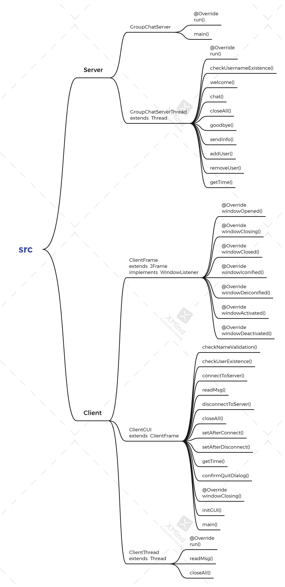
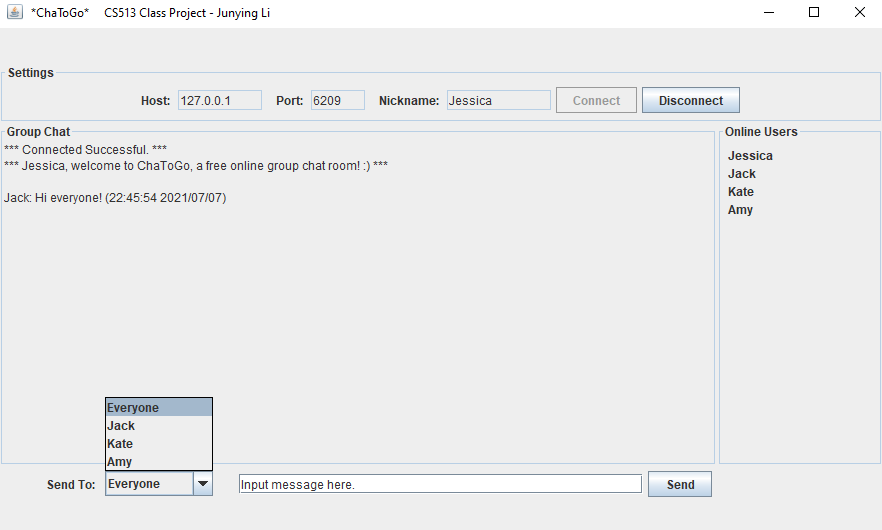
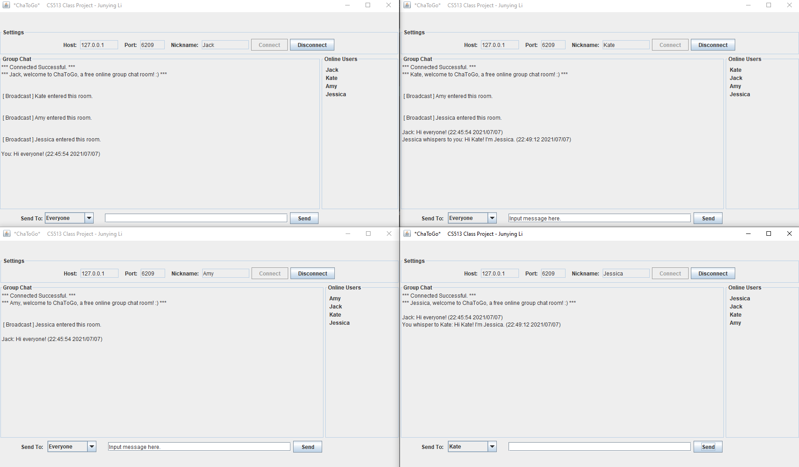
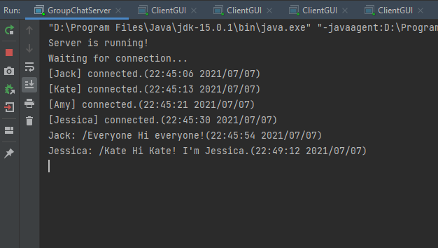

# Client-Server Online Chatroom Project

This is the final project for CS513 in WPI.

This project implemented a Client-Server online chatroom. Using Java Socket programming, the server can handle all requests
from multiple clients. Multiple users are able to connect or disconnect to the server, and
chat with each other in this chat room. To protect users’ privacy, clients are able to choose a
nickname before joining the chat room. They can also whisper to some other client without
having messages displayed to others, or they can make it public. There is a user list board on
the right side of client GUI which displays all online users. This list will refresh every time
when someone joins or leaves the chat room. For safety concern, the server is
designed stable after client termination, and so does the clients after server termination. 
The design and program are modular in nature
and make maximum use of abstract data types and of software re-use. 

If you would like to know more details, please check the project report.

Here is the mind map for software design.

Here are several screenshots:

*Figure-1 Client GUI*

*Figure-2 Multi-client Chatting*

*Figure-3 Server Log*
